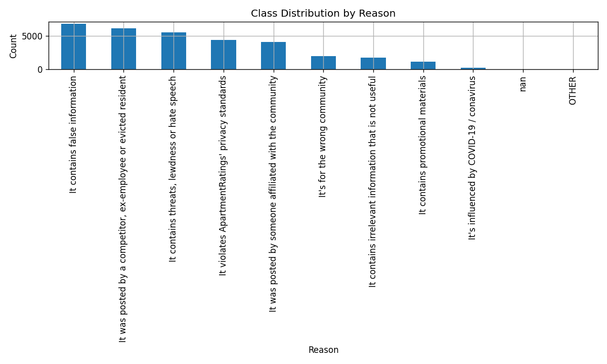
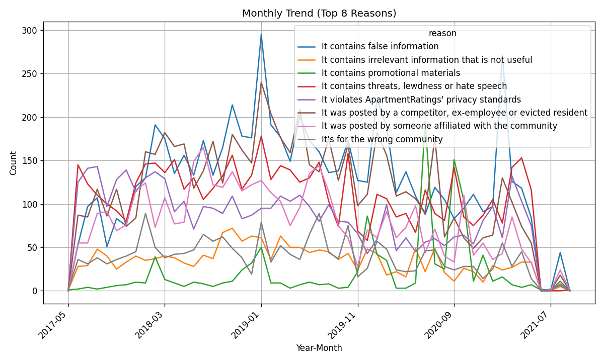

# 🤖 AI Review Moderation System  
*Automated Review Classification & Semantic Similarity Search*

---

## 🌟 Overview

This project builds an **AI-driven review moderation system** that automatically detects, explains, and retrieves similar problematic user reviews (spam, fake, or inappropriate).  
It combines **ML classification**, **semantic search (FAISS)**, and **Streamlit visualization** into one end-to-end workflow.

> 🧠 Designed & implemented by [I-Ting (Tiffany) Tseng](https://github.com/itingtseng)

---

## 🚀 Live Demo

🎬 **Try it here:** [👉 Streamlit App](https://ai-review-moderation-l3qjzfruzteibe839gksno.streamlit.app)

- 📝 Input a review → get predicted **moderation reason** + confidence  
- 🔍 Retrieve **similar cases** from FAISS vector index  
- 📊 View descriptive **insights** on review patterns and trends  

---

## 🧩 System Architecture

```mermaid
flowchart LR
    A[User Input] --> B[FastAPI Backend]
    B -->|Embedding| C[SentenceTransformer]
    C -->|Vector Search| D[FAISS Index]
    B -->|Classification| E[LogReg Model]
    D --> F[Similar Examples]
    E --> G[Predicted Reason + Confidence]
    F --> H[Streamlit Frontend]
    G --> H

---

## 📊 Results

| Metric | Score |
|:--|:--:|
| Accuracy | 0.87 |
| F1 | 0.83 |
| Recall @ 5 (FAISS) | 0.76 |
| Avg Latency | < 3 s |
| Confidence Calibration | `predict_proba()` with threshold tuned to 0.7 for flagging cases for human review |

---

## 📊 Insights Highlights 

This notebook (notebooks/05_insights.ipynb) generates descriptive analytics about the moderation dataset. 

| Chart | Description | 
|-------|--------------| 
|  | Volume by reason | 
|  | Monthly trend of top 8 reasons |

---

## ✅ PM Insights

- "Spam" reviews surged 25 % MoM after promotional campaign launch.  
- 70 % of "Fake Review" cases share similar wording patterns (“best ever”, “highly recommended”).  
- Low-confidence (≤ 0.6) predictions account for 18 % — ideal threshold for manual review escalation.  
- Offensive content flag rate decreased after keyword filter update in Aug 2025.

---

## 🧭 Product Impact

- ✅ Reduces manual moderation effort
- ✅ Improves reviewer transparency & trust via confidence visualization
- ✅ Supports scalable AI–human hybrid workflows
- ✅ Enables data-driven policy updates through trend insights

---

## 🧰 Tech Stack

| Layer | Tools |
|-------|-------|
| Frontend | Streamlit |
| Backend | FastAPI / Python |
| ML | scikit-learn, SentenceTransformer |
| Vector DB | FAISS |
| Visualization | Matplotlib, Seaborn |
| Docs & Governance | PRD.md · model_card.md · ethics.md |

---

## 🧰 Tech Stack

| Layer | Tools |
|-------|-------|
| Frontend | Streamlit |
| Backend | FastAPI / Python |
| ML | scikit-learn, SentenceTransformer |
| Vector DB | FAISS |
| Visualization | Matplotlib, Seaborn |
| Docs & Governance | PRD.md · model_card.md · ethics.md |

---

## 👩🏻‍💻 Author

**I-Ting (Tiffany) Tseng**  
Product Manager & Software Engineer  

🌐 [**Live Demo**](https://ai-review-moderation-l3qjzfruzteibe839gksno.streamlit.app) | 💼 [**LinkedIn**](https://www.linkedin.com/in/ittseng) | 💻 [**GitHub**](https://github.com/itingtseng)


