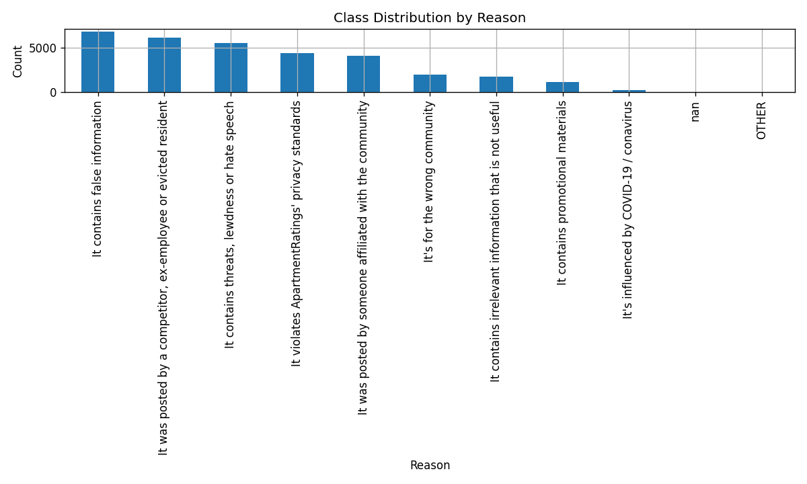

# 🧠 AI Review Moderation Demo

A lightweight **end-to-end AI moderation system** built for detecting and explaining risky user reviews (spam, fake, promotional, or policy-violating posts).  
This demo predicts moderation **reason**, shows **model confidence**, and retrieves **similar historical examples** using FAISS or TF-IDF fallback.

🌐 **Live Demo:** [https://ai-review-moderation.streamlit.app](https://ai-review-moderation.streamlit.app)

---

## 🚀 Features

- 🧩 Text input → Reason prediction (`model_baseline.pkl`)
- 📊 Confidence score and keyword highlights
- 🔍 Top-k similar examples retrieved via FAISS / TF-IDF cosine
- ⚙️ Auto-fallback if no index available
- 🌈 Streamlit-based UI (1-click deploy to Streamlit Cloud)

---

## 🧱 Architecture Overview

---

## 📊 Insights Highlights

This notebook (`notebooks/05_insights.ipynb`) generates descriptive analytics about the moderation dataset.

| Chart | Description |
|-------|--------------|
|  | Volume by `reason` |
|  | Monthly trend of top 8 reasons |

**PM Insights (auto-generated):**
```text
<copy the content of reports/insights/pm_insights_bullets.txt here>
